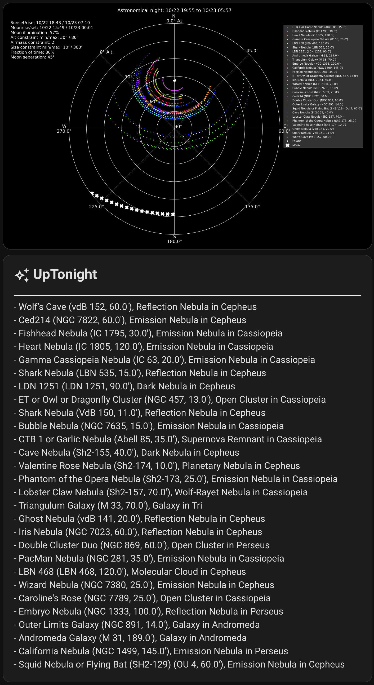

# AstroWeather<!-- omit in toc -->


[](https://github.com/custom-components/hacs)


This is a *Custom Integration* for [Home Assistant](https://www.home-assistant.io/). It uses the forecast data from 7Timer! and Met.no to create sensor data for Home Assistant. It uses the [7Timer!-API](http://www.7timer.info/doc.php?lang=en#machine_readable_api) to pull data from 7Timer! and the [Locationforecast-API](https://api.met.no/weatherapi/locationforecast/2.0/documentation) to pull from MET Norway Weather.


There is currently support for the following entity types within Home Assistant:

* Sensor
* Binary Sensor
* Weather

Forecast data is provided by a combination of 7Timer! and Met.no.

There is also a custom weather card available [here](https://github.com/mawinkler/astroweather-card) as seen in the screenshot above.

Amongst other calculations, the deep sky viewing conditions are calculated out of the combination of cloud coverage, seeing and transparency. For this calculation the cloud coverage is weighted three times and seeing two times in relation to the transparency.

> ***Other Peojects by me***:
> 
> [AstroLive](https://github.com/mawinkler/astrolive) - Monitor your observatory from within Home Assistant.
>
> [UpTonight](https://github.com/mawinkler/uptonight) - Calculate the best astro photography targets for the night at a given location.

## Table of Content<!-- omit in toc -->

- [How It Works](#how-it-works)
- [Usage](#usage)
  - [HACS installation](#hacs-installation)
  - [Manual Installation](#manual-installation)
  - [Configuration](#configuration)
  - [Lovelace](#lovelace)
- [UpTonight (optional)](#uptonight-optional)

## How It Works

- The AstroWeather integration has a dependency to [pyastroweatherio](https://github.com/mawinkler/pyastroweatherio) which is in charge to retrieve the forecast data and do the required calculations.
- During setup of the integration you're asked for some location info via a config flow.
- AstroWeather will then create a couple of sensors, binary sensors and a weather component to integrate with Home Assistant.
- For Lovelace you can either build your own configuration or use the [AstroWeather Card](https://github.com/mawinkler/astroweather-card). The card does provide a config editor for customization.
- All data is updated within a configurable interval in between 1 minute to 4 hours.
- The data has a resolution of 10 km (6.21 miles) and is updated every 4 hours.
- It is possible to use multiple instances of AstroWeather at the same time, even within different timezones.

## Usage

### HACS installation

This Integration is part of the default HACS store, so go to the HACS page and search for *AstroWeather* within the integrations.

### Manual Installation

To add AstroWeather to your installation, create this folder structure in your /config directory:

`custom_components/astroweather`.

Then drop the following files into that folder:

```yaml
__init__.py
binary_sensor.py
config_flow.py
const.py
entity.py
manifest.json
sensor.py
strings.json
weather.py
translation (Directory with all files)
```

### Configuration

To add AstroWeather to your installation, go to the Integration page inside the configuration panel and AstroWeather.

During installation you will have the option to:

- verify the longitude and latitude for the forecast
- set the elevation
- set the timezone
- set the interval for updating forecast data
- set the weightings for cloud coverage, seeing, and transparency for the condition calculation
- (optional) set the path pointing to your `/conf/www`-directory. Required only for UpTonight (see below)

The interval for updating forecast data and the weightings can also be changed after you add the Integration, by using the *Options* link on the Integration widget.

### Lovelace

There is a custom weather card available [here](https://github.com/mawinkler/astroweather-card).

It contains some of the sensor values as additional state attributes for use in the custome Lovelace card.

## UpTonight (optional)

[](http://www.astropy.org/)

Ever wanted to know tonights best possible targets? Astroweather in combination with [UpTonight](https://github.com/mawinkler/uptonight) is here to help. UpTonight calculates the best astro photography targets for the night at a given location. The default built in target list is a merge of Gary Imm's [My Top 100 Astrophotography Targets](https://www.astrobin.com/uc8p37/) and the top 200 taken from his incredible [Deep Sky Compendium](http://www.garyimm.com/compendium). Additional built-in target lists are the Messier objects and Herschel400.

UpTonight uses AstroPy which cannot be used asynchronously, so it needs to be separated from Home Assisntant.

Please refer to the documentation of [UpTonight](https://github.com/mawinkler/uptonight) on how to get it running. Below is the setup I'm using:

I run Home Assistant as a Container. It's `config`-directory is mapped to `/home/markus/smarthome/homeassistant`.
Ideally run UpTonight via docker-compose.yaml

```yaml
version: "3.2"
services:
  homeassistant:
    container_name: homeassistant
    image: homeassistant/home-assistant:2023.10
    depends_on:
      - influxdb
      - mqtt
    volumes:
      - /home/markus/smarthome/homeassistant:/config
      - /etc/localtime:/etc/localtime:ro
      - /etc/timezone:/etc/timezone:ro
      - /mnt/usb1:/data/usb1,ro
      - /mnt/usb2:/data/usb2,ro
      - /run/dbus:/run/dbus:ro
    ports:
      - 8123:8123
    restart: always
    network_mode: host

  uptonight:
    image: mawinkler/uptonight:latest
    container_name: uptonight
    environment:
      - LONGITUDE=48d7m36.804s
      - LATITUDE=11d34m38.352s
      - ELEVATION=519
      - TIMEZONE=Europe/Berlin
      - PRESSURE=1.022
      - TEMPERATURE=18
      - RELATIVE_HUMIDITY=0.7
    volumes:
      - /home/markus/smarthome/homeassistant/www:/app/out
```

The UpTonight container is not continuously running. When started it does the calculation, drops the output to the file system, and the exits. This just takes a couple of seconds.

To update the targets on a daily basis I run UpTonight every lunch time via cron:

```cron
0 12 * * * /usr/local/bin/docker-compose -f /home/markus/docker-compose.yaml up uptonight
```

For Home Assistant two files are relevant:

- `uptonight-report.json` - The calculated targets.
- `uptonight-plot.png` - A plot of the astronomical night.

To embed the list of targets into my Lovelace I use the markdown card:

```yaml
type: markdown
content: |-
  <h2>
    <ha-icon icon='mdi:creation-outline'></ha-icon>
    UpTonight
  </h2>
  <hr>
  
    
    <table><tr>
    - {{ item.name }}, {{ item.type }} in {{ item.constellation }}
    
  
  </tr></table>
```

For the plot, a picture card, here combined with the [browser_mod](https://github.com/thomasloven/hass-browser_mod)  from @thomasloven, does the trick for me:

```yaml
type: picture
image: /local/uptonight-plot.png
tap_action:
  action: fire-dom-event
  browser_mod:
    service: browser_mod.popup
    data:
      title: UpTonight
      size: wide
      content:
        type: picture
        image: /local/uptonight.png
        name: Live
```

Result:

