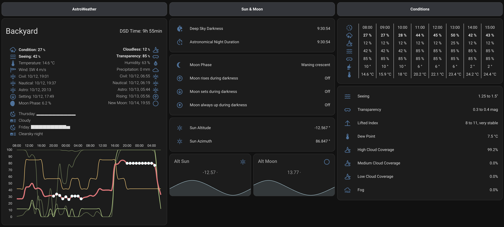

# AstroWeather<!-- omit in toc -->


[](https://github.com/custom-components/hacs)

This is a *Custom Integration* for [Home Assistant](https://www.home-assistant.io/). It uses the forecast data from 7Timer! and Met.no to create sensor data for Home Assistant. It uses the [7Timer!-API](http://www.7timer.info/doc.php?lang=en#machine_readable_api) to pull data from 7Timer! and the [Locationforecast-API](https://api.met.no/weatherapi/locationforecast/2.0/documentation) to pull from MET Norway Weather.



There is currently support for the following entity types within Home Assistant:

* Sensor
* Binary Sensor
* Weather

Forecast data is provided by 7Timer! on a three *hourly* basis which can optionally be merged with cloud area fraction data from Met.no.

There is also a custom weather card available [here](https://github.com/mawinkler/astroweather-card) as seen in the screenshot above.

Amongst other calculations, the deep sky viewing conditions are calculated out of the combination of cloud coverage, seeing and transparency. For this calculation the cloud coverage is weighted three times and seeing two times in relation to the transparency.

> ***NEW RELEASE***: [AstroLive](https://github.com/mawinkler/astrolive) - Monitor your observatory from within Home Assistant.

## Table of Content<!-- omit in toc -->

- [How It Works](#how-it-works)
- [Usage](#usage)
  - [HACS installation](#hacs-installation)
  - [Manual Installation](#manual-installation)
  - [Configuration](#configuration)
- [Lovelace](#lovelace)

## How It Works

- The AstroWeather integration has a dependency to [pyastroweatherio](https://github.com/mawinkler/pyastroweatherio) which is in charge to retrieve the forecast data and do the required calculations.
- During setup of the integration you're asked for some location info via a config flow.
- AstroWeather will then create a couple of sensors, a binary sensor and a weather component to integrate with Home Assistant.
- For Lovelace you can either build your own configuration or use the [AstroWeather Card](https://github.com/mawinkler/astroweather-card).
- All data is updated within a configurable interval in between 1 minute to 4 hours.
- The data has a resolution of 10 km (6.21 miles) and is updated every 4 hours.
- It is possible to use multiple instances of AstroWeather at the same time, even within different timezones.

## Usage

### HACS installation

This Integration is part of the default HACS store, so go to the HACS page and search for *AstroWeather* within the integrations.

### Manual Installation

To add AstroWeather to your installation, create this folder structure in your /config directory:

`custom_components/astroweather`.

Then drop the following files into that folder:

```yaml
__init__.py
binary_sensor.py
config_flow.py
const.py
entity.py
manifest.json
sensor.py
strings.json
weather.py
translation (Directory with all files)
```

### Configuration

To add AstroWeather to your installation, go to the Integration page inside the configuration panel and AstroWeather.

During installation you will have the option to:

- verify the longitude and latitude for the forecast
- set the elevation
- set the timezone
- set the interval for updating forecast data
- set the weightings for cloud coverage, seeing, and transparency for the condition calculation

The interval for updating forecast data and the weightings can also be changed after you add the Integration, by using the *Options* link on the Integration widget.

## Lovelace

There is a custom weather card available [here](https://github.com/mawinkler/astroweather-card).

It contains some of the sensor values as additional state attributes for use in the custome Lovelace card.
